## 1. Bối cảnh dữ liệu bán lẻ và khái niệm GIGO 
### 1.1. Bối cảnh
Ngành bán lẻ hiện đại đang bước vào kỷ nguyên số, nơi dữ liệu trở thành yếu tố cốt lõi giúp doanh nghiệp đưa ra quyết định kinh doanh và tạo lợi thế cạnh tranh. 
Sự phát triển của mô hình bán lẻ hợp kênh (*Omnichannel*) khiến dữ liệu được tạo ra liên tục từ nhiều nguồn khác nhau như hệ thống điểm bán hàng (POS), thương mại điện tử, chương trình khách hàng thân thiết và hệ thống quản lý tồn kho. Tuy nhiên, sự gia tăng nhanh chóng về khối lượng, tốc độ và đa dạng của dữ liệu cũng làm gia tăng rủi ro về tính chính xác và nhất quán. 

Tại Việt Nam, quá trình chuyển đổi sang bán lẻ hợp kênh đang diễn ra mạnh mẽ. Nhiều doanh nghiệp đã tích hợp dữ liệu từ cửa hàng vật lý và nền tảng trực tuyến nhằm xây dựng hồ sơ khách hàng toàn diện và tối ưu vận hành. Mặc dù vậy, tình trạng phân mảnh dữ liệu giữa các kênh vẫn là thách thức lớn, dẫn đến sai lệch trong dự báo nhu cầu, quản lý tồn kho và hoạch định chiến lược kinh doanh.

### 1.2. Khái niệm GIGO
Khái niệm "*Garbage In, Garbage Out*" (GIGO) là một nguyên lý nền tảng trong khoa học máy tính và phân tích dữ liệu, nhấn mạnh rằng chất lượng đầu ra của một hệ thống phụ thuộc hoàn toàn vào chất lượng đầu vào. Dù hệ thống có phức tạp hay thuật toán AI có tiên tiến đến đâu, nếu dữ liệu đầu vào bị lỗi, thiếu sót hoặc sai lệch, kết quả tạo ra sẽ là vô giá trị hoặc thậm chí gây hại. 

Nguồn gốc của thuật ngữ này có sự liên hệ sâu sắc với lịch sử điện toán. Charles Babbage, người được coi là cha đẻ của máy tính, đã từng bày tỏ sự ngạc nhiên trước câu hỏi liệu một cỗ máy có thể cho ra câu trả lời đúng từ những dữ liệu sai hay không. 
Vào năm 1957, William D. Mellin, một chuyên gia toán học của quân đội Mỹ, đã khẳng định rằng máy tính không thể tự suy nghĩ và các đầu vào "lập trình cẩu thả" sẽ dẫn đến kết quả sai. 
Đến thập niên 1960, George Fuechsel của IBM đã phổ biến rộng rãi cụm từ này để giáo dục người dùng về tầm quan trọng của tính chính xác trong nhập liệu.

## 2. Vai trò của Data cleaning
### 2.1. Khái niệm của Data cleaning
Thuật ngữ *Data cleaning* chỉ quá trình xử lý dữ liệu để làm sạch bộ dữ liệu thô. Các thao tác *cleaning* hướng đến cải thiện chất lượng và khả năng sử dụng của dữ liệu một cách nhất quán.
    Trong thực tế, dữ liệu thu thập từ nhiều hệ thống khác nhau thường tồn tại nhiều vấn đề như:
    - Giá trị bị thiếu (Missing values)
    - Dữ liệu trùng lặp (Duplicates)
    - Sai định dạng (Format errors)
    - Giá trị không hợp lệ (Invalid values)
Quá trình làm sạch dữ liệu giúp đảm bảo rằng dữ liệu có thể được sử dụng một cách đáng tin cậy trong các hoạt động phân tích và ra quyết định.

Tầm quan trọng của làm sạch dữ liệu trong các lĩnh vực khác nhau:
1. Phân tích dữ liệu:
    - Đảm bảo tính chính xác trong đưa ra các quyết định quan trọng: Tính toàn vẹn của kết luận phụ thuộc vào độ sạch của dữ liệu.
    - Giảm thiểu sai lệch trong quá trình phân tích, đặc biệt trong nghiên cứu và phát triển khoa học, doanh nghiệp,...
2. Khoa học dữ liệu:
    - Chiếm 60-80% thời gian, công sức của dự án 
    - Giúp các nhà khoa học xây dựng mô hình có độ tin cậy cao. 
    - Tối ưu các thuật toán: cả về chi phí, thời gian.
3. Học máy:
    - Nền tảng xây dựng mô hình học máy (*Machine Learning*) hiệu quả.
    - Cải thiện khả năng tổng quan trên dữ liệu mới.
    - Giảm thiểu rủi ro quá khớp (*overfitting*).

5 tiêu chuẩn để đánh giá chất lượng dữ liệu sau khi dọn dẹp:
1. Accuracy (*Tính chính xác*): Dữ liệu phải phản ánh đúng thực tế khách quan. 
    - Đơn giá sản phẩm trong bộ dữ liệu Online Retail phải khớp với giá niêm yết trên hệ thống bán hàng thực tế.
2. Completeness (*Tính đầy đủ*): Dữ liệu không được thiếu các thành phần quan trọng cho mục tiêu phân tích.
   - Việc thiếu mã khách hàng (CustomerID) sẽ làm gãy chuỗi phân tích hành vi người dùng
3. Consistency (*Tính nhất quán*): Dữ liệu phải đồng nhất giữa các bảng và các nguồn.
    - Định dạng ngày tháng hoặc tên quốc gia không được mâu thuẫn giữa các tệp dữ liệu khác nhau
4. Validity (*Tính hợp lệ*): Dữ liệu phải tuân thủ các quy tắc nghiệp vụ.
    - Cột "Quantity" (Số lượng) phải là số dương; các giá trị âm không rõ lý do được coi là không hợp lệ và cần xử lý
5. Timeliness (*Tính kịp thời*):  Dữ liệu phải sẵn có và được cập nhật mới nhất tại thời điểm cần ra quyết định.
    - Dữ liệu quá cũ sẽ không còn phản ánh đúng xu hướng thị trường hiện tại.

### 2.2.Phân biệt *cleaning* và *transformation*
|Đặc điểm|Cleaning|Transformation|
|---|---|---|
|Mục tiêu|Đảm bảo dữ liệu đầy đủ, chính xác|Chuyển cấu trúc dữ liệu sang dạng phù hợp hơn cho phân tích|
|Hoạt động chính|- Sửa lỗi nhập liệu: sai chính tả, thiếu dữ liệu - Loại bỏ sự trùng lặp - Loại bỏ số liệu không hợp lệ (NaN, số âm) - Loại bỏ dữ liệu nhiễu (không liên quan)|- Chuẩn hóa đơn vị đo - Dùng Pivot/Unipivot để thay đổi cấu trúc - Áp dụng các phép toán chuẩn hóa dữ liệu về cùng thang đo - Tạo biến mới từ dữ liệu gốc|
|Kết quả|Dữ liệu chính xác, không còn "rác"|Dữ liệu sẵn sàng cho mô hình hóa và báo cáo|
|Ví dụ|Trim, Remove Duplicates, Replace Null|Unpivot, Group By, Split Column, Merge|

### 2.3. Tư duy xử lý dữ liệu giữa *GUI* và *Code*
Tư duy GUI (Power Query)

Tư duy GUI trong Power Query tập trung vào tính trực quan thông qua quy trình Get & Transform
- Ghi lại lịch sử (*Applied Steps*): Thay vì viết code, mọi thao tác (như lọc null, đổi định dạng) đều được ghi lại thành các bước thực hiện
. Điều này giúp người dùng không chuyên cũng có thể hiểu và kiểm soát luồng xử lý dữ liệu.
- Phân tích nhanh (*Efficiency*): GUI cực kỳ hiệu quả cho dữ liệu vừa và nhỏ (dưới 1 triệu dòng), cho phép tạo báo cáo chỉ trong 2-3 tiếng
- Tính kế thừa: Khi có dữ liệu mới, người dùng chỉ cần nhấn Refresh để hệ thống chạy lại các bước đã lưu mà không cần can thiệp kỹ thuật
    
Tư duy Code (SQL/Pandas)

Khi sử dụng Code, nhà phân tích chuyển sang tư duy xây dựng luồng logic (Pipeline) linh hoạt hơn
- Xử lý quy mô lớn (*Scalability*): Code cho phép xử lý hàng triệu đến hàng tỷ dòng dữ liệu, nơi mà Excel thường gặp giới hạn về hiệu suất
- Logic phức tạp: Các ngôn ngữ như SQL/Pandas hỗ trợ các phép toán sâu như Window Functions hoặc các mô hình máy học (Machine Learning) mà GUI khó có thể đáp ứng
- Tự động hóa sâu: Thay vì ghi lại bước thao tác, code sử dụng các hàm (functions) và script để kết nối đa nguồn dữ liệu (SQL, API, Cloud) và tự động hóa toàn bộ quy trình thu thập - xử lý

So sánh tư duy xử lý dữ liệu giữa *GUI* (Power Query) và *Code* (SQL/Pandas)

|Đặc điểm|GUI (Power Query)|Code (SQL/Pandas)|
|---|---|---|
|Cách tiếp cận|Tương tác trực quan trên thanh Ribbon|Xây dựng logic qua mã lệnh script|
|Lịch sử xử lý|Bảng Applied Steps tự động|Tệp code (.sql, .py) được lưu trữ|
|Giới hạn|Tối ưu cho < 1 triệu dòng|Xử lý dữ liệu cực lớn (Big Data)|
|Độ linh hoạt|Thao tác theo tính năng có sẵn|Tùy biến logic cực cao qua hàm|

### 2.3. Bảng thuật ngữ Anh-Việt.

|Thuật ngữ Anh|Thuật ngữ Việt|Ý nghĩa kỹ thuật|
|---|---|---|
Raw Data|Dữ liệu thô|Dữ liệu chưa qua xử lý, còn nhiều sai sót|
Missing Data|Dữ liệu thiếu|Các ô trống (null) trong tập dữ liệu|
Duplicates|Dữ liệu trùng lặp|Các bản ghi bị lặp lại không mong muốn|
Outliers|Giá trị ngoại lai|Các giá trị bất thường so với phần còn lại|
Data Profiling|Phân tích hồ sơ dữ liệu|Đánh giá chất lượng dữ liệu trước khi dọn dẹp|
Applied Steps|Các bước đã thực hiện|Bảng lưu lịch sử thao tác trong Power Query|
Unpivot|Hủy xoay cột|Chuyển dữ liệu từ dạng ngang sang dạng dọc|
Consistency|Tính nhất quán|Sự đồng nhất về định dạng và thông tin|

## 3. Các công cụ làm sạch dữ liệu
Một số công cụ phổ biến và hiệu quả:
1. **Power Query (ETL)**
2. **Excal Data Analysis ToolPak (Thống kê)**
3. **Lập trình Python (Validation)**

Blog đưa ra dự án chuẩn hóa bộ dữ liệu Oneline Retail chứa các giao dịch xuyên biên giới. Đặc thù dữ liệu thô có độ nhiễu cao do lỗi nhập liệu, đơn hàng hủy và khách hàng vãng lai.

Mục tiêu dự án hướng đến xây dựng Pipeline dữ liệu sạch sẽ và hệ thống báo cáo với quy mô 541.999 dòng dữ liệu gốc.

Link csv: [Download dữ liệu CSV](OnlineRetail.csv)

### 3.1. Power Query Engineering - Pipeline ETL

Áp dụng quy trình 8 bước nghiêm ngặt trên Power Query

<u> **Bước 1: Chấn đoán sức khỏe dữ liệu** </u>

- Import file csv:
Data -> Get Data -> From File -> From Workbook. 
<p align = "center">
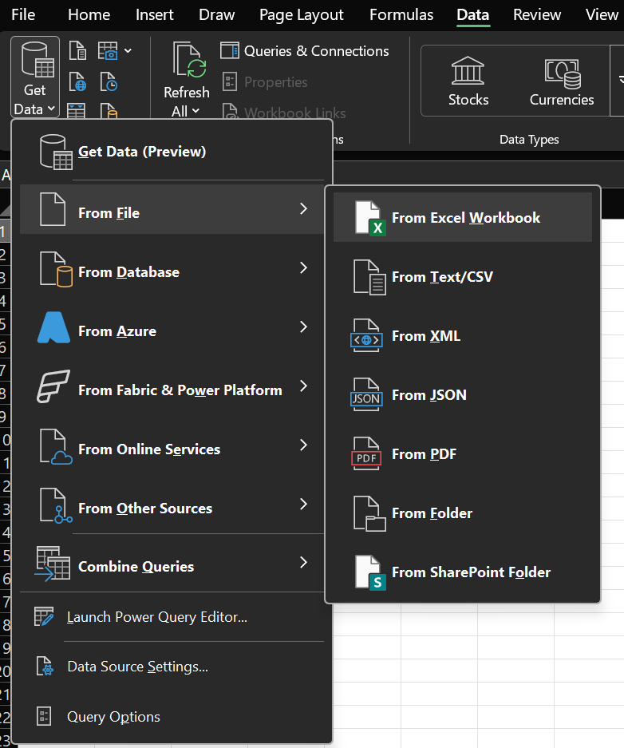
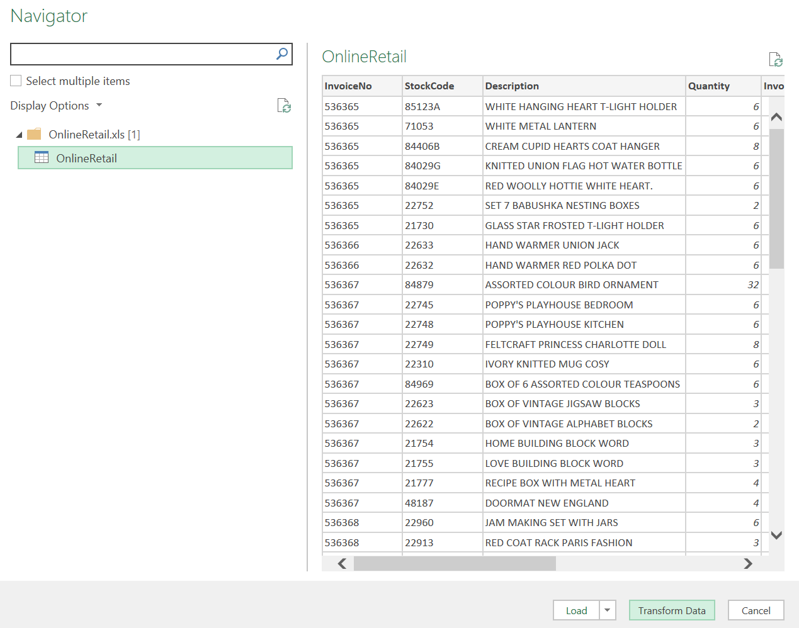
</p>

Ngay khi nạp, kích hoạt *Column Quality* và *Column Distribution* trong tab View
<p align = "center">
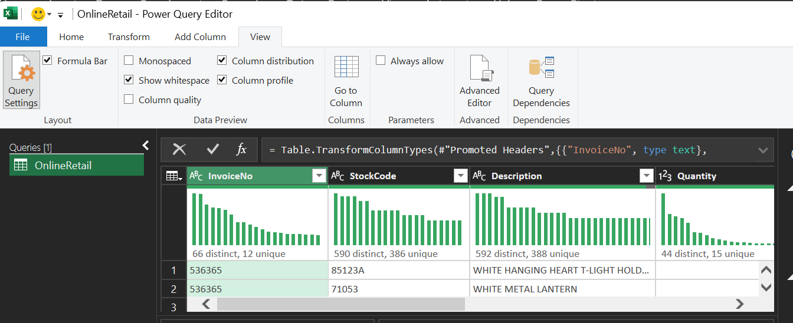
</p>

Kích hoạt các công cụ định lượng ngay tại nguồn:
- Column Quality: Kiểm tra tỷ lệ "*Valid*", "*Error*" và "*Empty*". Kết quả cho thấy, cột *CustomerID* chỉ có 75.1% dữ liệu hợp lệ.
- Column Distribution: Nhận diện sự phân bổ của các mã hàng. Biểu đồ cho thấy sự hiện diện của các mã không phải sản phẩm như *POST* (phí bưu điện), *D* (giảm giá), *M* (thao tác tay).
- Column Profile: Cung cấp thống kê chi tiết cho từng cột (Min, Max, Mean). Phát hiện *Quantity* âm (-80,995). Đây là các giao dịch trả hàng cần xử lý.

Biểu đồ Column Profile hiển thị giá trị Min/Max của Quantity 
<p align = "center">
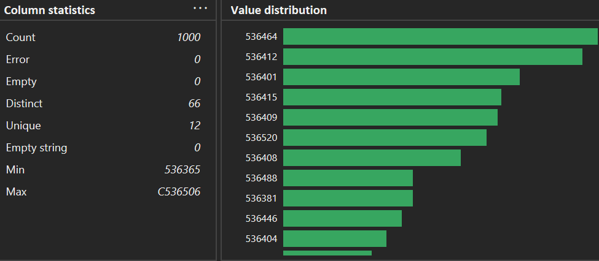
</p>


<u> **Bước 2: Xử lý dữ liệu bị thiếu** </u>

Phân tích cho thấy có 135,080 dòng thiếu định danh khách hàng.

- Thao tác: Nhấp chuột phải vào cột CustomerID > Remove Empty.
- Giải trình kỹ thuật: Tại sao chọn lọc bỏ thay vì thay thế (Imputation)?
    - Tính định danh: *CustomerID* là "khóa ngoại" duy nhất để liên kết với hành vi khách hàng. Nếu điền mã giả (ví dụ: 0), hệ thống sẽ hiểu 135,080 giao dịch này thuộc về cùng một người, làm hỏng hoàn toàn phân tích lòng trung thành (*Retention Rate*).
    - Mục tiêu RFM: Để tính toán *Recency* (Ngày mua gần nhất) và Frequency (Tần suất), ta bắt buộc phải có thông tin định danh chính xác từ hệ thống CRM.
Kết quả:
<p align = "center">
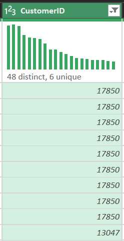
</p>

<u> **Bước 3: Lọc nhiễu giao dịch** </u>

Dữ liệu thô chứa các giao dịch hủy (mã hóa bằng tiền tố '*C*' trong *InvoiceNo*) và các dòng thử nghiệm.

- Thao tác: Thiết lập bộ lọc kép 
    *Number Filter* > *Greater Than 0* 
    cho đồng thời hai cột số lượng và đơn giá.
- Ý nghĩa nghiệp vụ: Loại bỏ đơn hàng bị hủy, quà tặng tặng kèm (giá 0) và nợ xấu. Điều này giúp tính toán Doanh thu thực tế (Net Revenue) thay vì doanh thu ảo.

<p align = "center">
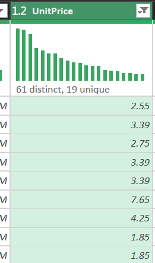
</p>


<u> **Bước 4: Định dạng dữ liệu** </u>

Ép kiểu dữ liệu để tối ưu hóa hiệu năng tính toán trong Excel Data Model:

- *InvoiceDate*: Chuyển sang Date/Time (Cho phép phân tích xu hướng mua hàng theo giờ/tháng).
- *UnitPrice*: Chuyển sang Decimal Number (Bảo toàn độ chính xác tiền tệ).
- *Quantity*: Chuyển sang Whole Number (Số lượng đơn vị sản phẩm).
- *CustomerID*: Chuyển sang Whole Number (Dùng làm định danh thay vì văn bản).

<p align = "center">
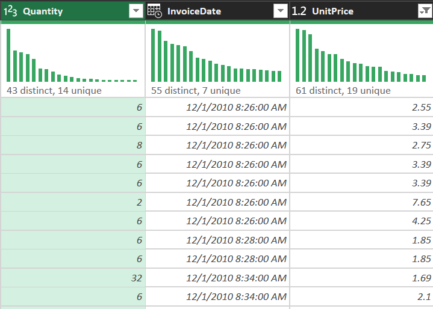
</p>

<u> **Bước 5: Text Cleaning – Chuẩn hóa SKUs** </u>

Cột Description chứa nhiều lỗi nhập liệu thủ công:

- Trim: Loại bỏ khoảng trắng thừa đầu và cuối chuỗi.
- Clean: Loại bỏ các ký tự ẩn gây lỗi định dạng.
- Capitalize Each Word: Đồng nhất cách viết 

(ví dụ: "  red  mug" -> "Red Mug").

    --> Kết quả: Đảm bảo khi chạy Pivot Table, các sản phẩm không bị tách rời vô lý.

<p align = "center">
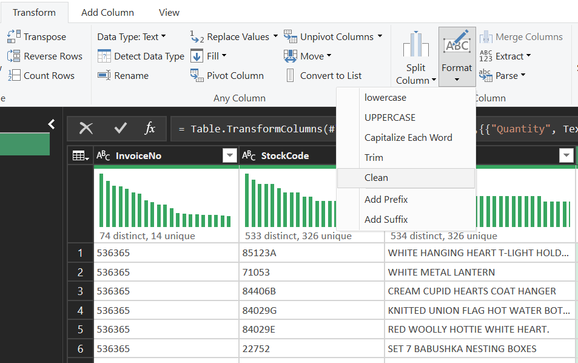
</p>

<u> **Bước 6: Tạo cột trạng thái đơn hàng** </u>

Xây dựng cột logic để phân loại quy mô giao dịch:

- Thao tác: Add Column > Conditional Column.
- Logic: if [Quantity] > 100 then "*Wholesale*" else "*Retail*".
- Mục đích: Hỗ trợ Designer tạo *Slicer* trên Dashboard để so sánh hành vi giữa nhóm khách mua sỉ và mua lẻ.

<p align = "center">
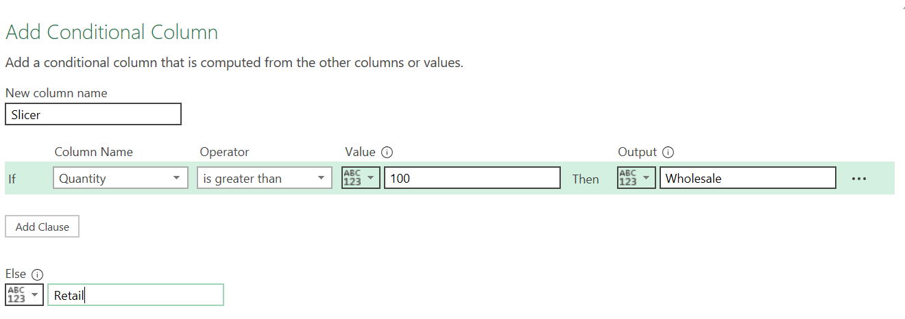
</p>
<p align = "center">
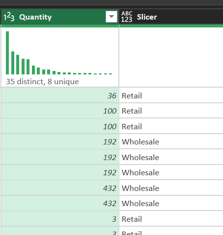
</p>

<u> **Bước 7: Chi lại lịch sử thao tác** </u>

Mọi bước trên được ghi lại trong bảng Applied Steps.
- Ý nghĩa: Đây là "kịch bản" tự động hóa. Khi có tệp dữ liệu tháng tiếp theo, chúng ta chỉ cần nhấn *Refresh*, Power Query sẽ tự động lặp lại 8 bước này, loại bỏ 100% sai sót thủ công và đảm bảo tính nhất quán (*Reproducibility*).

<p align = "center">
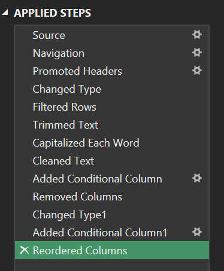
</p>

<u> **Bước 8: Advanced Editor & Ngôn ngữ M-Code** </u>

Đối với bước phức tạp nhất, khuyến khích sử dụng *Advanced Editor* để kiểm soát trực tiếp mã nguồn.

Mã M-code chi tiết xử lý pipeline:
```m
let
    Source = Excel.Workbook(File.Contents("C:\Data\OnlineRetail.xlsx"), null, true),
    Data = Source{[Item="Sheet1",Kind="Sheet"]}[Data],
    #"Promoted Headers" = Table.PromoteHeaders(Data, [PromoteAllScalars=true]),
    // Lọc bỏ rác và null trong một bước duy nhất để tối ưu Query Folding
    #"CleanedData" = Table.SelectRows(#"Promoted Headers", each [CustomerID] <> null and [Quantity] > 0 and [UnitPrice] > 0),
    #"ChangedTypes" = Table.TransformColumnTypes(#"CleanedData",{
        {"Quantity", Int64.Type}, {"UnitPrice", type number}, {"CustomerID", Int64.Type}, {"InvoiceDate", type datetime}
    }),
    #"FormattedText" = Table.TransformColumns(#"ChangedTypes", {{"Description", each Text.Proper(Text.Trim(_)), type text}}),
    #"AddedStatus" = Table.AddColumn(#"FormattedText", "OrderType", each if [Quantity] > 100 then "Wholesale" else "Retail")
in
    #"AddedStatus"
```
<p align = "center">
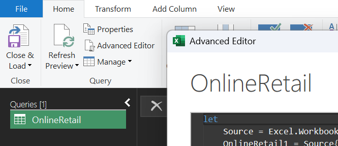
</p>


### 3.2. Phân tích thống kê, vai trò của Analyst

Sử dụng bộ công cụ *Descriptive Statistics* trong Excel để giải mã các con số đằng sau tập dữ liệu đã sạch.

Chỉ số mô tả chuyên sâu:
|Chỉ số|Giá trị|Phân tích chuyên sâu
|---|---|---|
|MEAN|$22.39|Giá trị doanh thu trung bình trên mỗi dòng sản phẩm|
|MEDIAN|$12.30|Điểm trung tâm thực sự của dữ liệu, phản ánh khách lẻ bình thường|
|Std Dev $$\sigma $$|$165.05|TĐộ lệch chuẩn phản ánh mức độ dao động mạnh giữa các mã hàng|
|Skewness|3.2|Hệ số lệch dương, chứng tỏ doanh nghiệp có cơ sở khách hàng lẻ rộng|


Công thức độ lệch chuẩn:


$$
\
\sigma = \sqrt{\frac{1}{N} \sum_{i=1}^{N} (x_i - \mu)^2}
\
$$

Tại sao Median lại là "vị cứu tinh"?

- Trong bộ dữ liệu này, các khách bán sỉ (*Wholesalers*) mua hàng nghìn món tạo ra các *Outliers* cực lớn kéo chỉ số *MEAN* lên cao giả tạo. Chỉ số *MEDIAN* = 12.30 không bị ảnh hưởng bởi giá trị ngoại lai, giúp nhà quản lý nhận diện đúng hành vi tiêu dùng của 90% khách hàng lẻ (*Retailers*).

### 3.3. Python 
Sử dụng Python để kiểm chứng lại toàn bộ Pipeline của Power Query, đảm bảo tính khách quan 

1. **Chuẩn bị** 

Các thư viện 
```python
from pathlib import Path
import matplotlib.pyplot as plt
import pandas as pd
from google.colab import files
from IPython.display import display
```
Phần format pandas
```python
pd.set_option("display.max_columns", None)
pd.set_option("display.float_format", lambda value: f"{value:,.2f}")
```

Tải file lên Colab và đọc bằng pandas
```python
input_path = Path(next(iter(files.upload())))
raw_data = pd.read_excel(input_path, engine = "xlrd")
```

Link csv: [Download dữ liệu CSV](OnlineRetail.csv)

2. **Cách đặt tên cột**

Đặt tên cột không có khoảng trắng: 
    - NameName 
    - Name_Name

```python
TEXT_COLUMNS = ["InvoiceNo", "StockCode", "Description", "Country"]

# Đưa vào giá trị mỗi cột --> Hợp lệ
REQUIRED_COLUMNS = [
    "InvoiceNo",
    "StockCode",
    "Description",
    "Quantity",
    "InvoiceDate",
    "UnitPrice",
    "Country",
]
```

3. **Chuẩn hóa chữ và giá trị rỗng**

```python 
def normalize_text(text_series: pd.Series) -> pd.Series:
    return (
        # Chuyển về string
        text_series.astype("string")
        # Xóa khoảng trắng thừa 
        .str.replace(r"\s+", " ", regex=True)
        .str.strip()
        # Đưa ra giá trị rỗng về NaN 
        .replace({"": pd.NA, "<NA>": pd.NA})
    )
```
4. **Báo cáo dữ liệu**

Tạo bảng chỉ số để so sánh dữ liệu trước & sau khi làm sạch.
```python
def build_report(data_frame: pd.DataFrame) -> pd.DataFrame:
    summary_values = {
        "total_rows": len(data_frame),
        "missing_customer_id": data_frame["CustomerID"].isna().sum(),
        "cancelled_invoices": data_frame["InvoiceNo"].str.startswith("C", na=False).sum(),
        "non_positive_quantity": data_frame["Quantity"].le(0).sum(),
        "non_positive_unit_price": data_frame["UnitPrice"].le(0).sum(),
        "duplicate_rows": data_frame.duplicated().sum(),
        "gross_sales": round(data_frame["SaleAmount"].fillna(0).sum(), 2),
        "mean_quantity": round(data_frame["Quantity"].dropna().mean(), 2),
        "median_quantity": round(data_frame["Quantity"].dropna().median(), 2),
        "mean_unit_price": round(data_frame["UnitPrice"].dropna().mean(), 2),
        "median_unit_price": round(data_frame["UnitPrice"].dropna().median(), 2),
        "mean_sale_amount": round(data_frame["SaleAmount"].dropna().mean(), 2),
        "median_sale_amount": round(data_frame["SaleAmount"].dropna().median(), 2),
    }

    return pd.DataFrame(summary_values.items(), columns=["metric", "value"])
```
Kết quả trả về:

<p align = "center">
    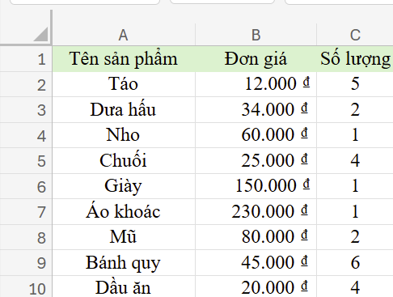
    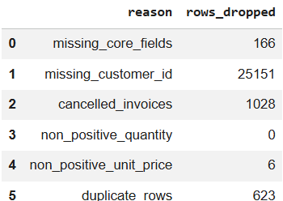
</p>

5. **Làm sạch dữ liệu**
```python
def clean_online_retail(raw_data: pd.DataFrame):
    # Sao chép dữ liệu gốc: Tránh sửa trực tiếp
    cleaned_data = raw_data.copy()

    # Làm sạch cột: Tránh sự trùng lặp + khoảng trắng
    for column_name in TEXT_COLUMNS:
        cleaned_data[column_name] = normalize_text(cleaned_data[column_name])

    # Chuẩn hóa mã khách hàng - Ví dụ: 123.0 --> 123
    cleaned_data["CustomerID"] = normalize_text(cleaned_data["CustomerID"]).str.replace(
        r"\.0$", "", regex=True 
    )

    # Đưa cột ngày/tháng về đúng kiểu dữ liệu: integer, NaN
    cleaned_data["Quantity"] = pd.to_numeric(
        cleaned_data["Quantity"], errors="coerce"
    ).astype("Int64")
    cleaned_data["UnitPrice"] = pd.to_numeric(cleaned_data["UnitPrice"], errors="coerce")
    cleaned_data["InvoiceDate"] = pd.to_datetime(
        cleaned_data["InvoiceDate"], errors="coerce"
    )

    # Tính giá trị dòng hàng để thống kê doanh nghiệp: nhân số lượng đơn giá với dạng float
    cleaned_data["SaleAmount"] = (
        cleaned_data["Quantity"].astype("float") * cleaned_data["UnitPrice"]
    ).round(2)

    # Tạo bảng thống kê trước khi làm sạch --> Sẽ in ra 
    before_table = build_report(cleaned_data).rename(columns={"value": "before_clean"})

    # Tạo quy tắc để loại bỏ dữ liệu không hợp lý.
    invalid_rules = [
        ("missing_core_fields", cleaned_data[REQUIRED_COLUMNS].isna().any(axis=1)),
        ("missing_customer_id", cleaned_data["CustomerID"].isna()),
        ("cancelled_invoices", cleaned_data["InvoiceNo"].str.startswith("C", na=False)),
        ("non_positive_quantity", cleaned_data["Quantity"].le(0)),
        ("non_positive_unit_price", cleaned_data["UnitPrice"].le(0)),
    ]

    # Giả sử tất cả các dòng đều hợp lý
    keep_row = pd.Series(True, index=cleaned_data.index)
    # Tạo hàm loại bỏ
    removed_rows = []

    # Áp dụng từng quy tắc theo thứ tự 
    for rule_name, invalid_row in invalid_rules:
        current_removed_row = keep_row & invalid_row
        removed_rows.append((rule_name, int(current_removed_row.sum())))
        keep_row &= ~invalid_row

    # Loại bỏ trùng lặp sau khi lọc các dòng
    final_data = cleaned_data.loc[keep_row].drop_duplicates().copy()
    duplicate_rows = int(cleaned_data.loc[keep_row].duplicated().sum())

    # Sắp xếp dữ liệu
    final_data = final_data.sort_values(
        ["InvoiceDate", "InvoiceNo", "StockCode"]
    ).reset_index(drop=True)

    # Tạo bảng thống kê sau khi làm sạch --> Sẽ in ra
    after_table = build_report(final_data).rename(columns={"value": "after_clean"})
    comparison_table = before_table.merge(after_table, on="metric")

    # Bảng index bị loại + lý do đi kèm
    removed_table = pd.DataFrame(
        removed_rows + [("duplicate_rows", duplicate_rows)],
        columns=["reason", "rows_dropped"],
    )

    return final_data, comparison_table, removed_table
```

6. **Biểu diễn biểu đồ giá trị MEAN và MEDIAN**
```python
# Nhóm lại chỉ số đếm lượng bản ghi + lỗi dữ liệu 
count_metrics = [
    "total_rows",
    "missing_customer_id",
    "cancelled_invoices",
    "duplicate_rows",
]

# Nhóm lại chỉ số giá trị xem xu hướng MEAN và MEDIAN
value_metrics = [
    "mean_quantity",
    "median_quantity",
    "mean_unit_price",
    "median_unit_price",
    "mean_sale_amount",
    "median_sale_amount",
]

figure, axes = plt.subplots(1, 2, figsize=(14, 5))

# Biểu đồ 1: So sánh các chỉ đố đếm trước & sau khi làm sạch
comparison_table[comparison_table["metric"].isin(count_metrics)].set_index("metric")[
    ["before_clean", "after_clean"]
].plot(kind="bar", ax=axes[0], color=["#d97706", "#15803d"])
axes[0].set_title("Count Metrics")
axes[0].set_xlabel("")
axes[0].set_ylabel("Count")
axes[0].tick_params(axis="x", rotation=0)

# Biểu đồ 2: So sánh MEAN (average) và MEDIAN trước & sau khi làm sạch
comparison_table[comparison_table["metric"].isin(value_metrics)].set_index("metric")[
    ["before_clean", "after_clean"]
].plot(kind="bar", ax=axes[1], color=["#2563eb", "#16a34a"])
axes[1].set_title("Mean and Median")
axes[1].set_xlabel("")
axes[1].set_ylabel("Value")
axes[1].tick_params(axis="x", rotation=45)

plt.tight_layout()
plt.show()
```

Kết quả trả về: 
<p align = "center">
    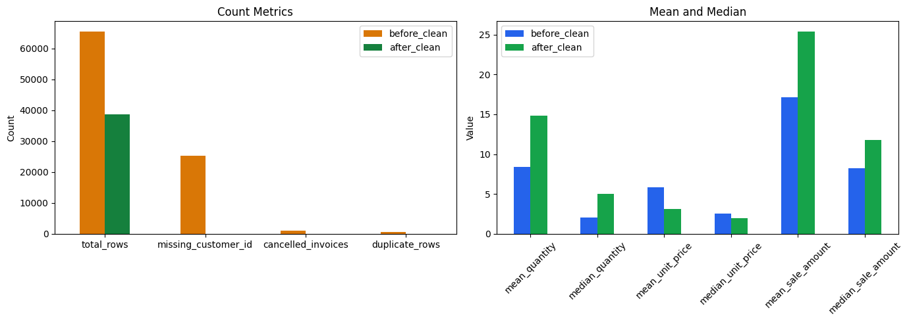
</p>

7. **Đặt tên và định dạng file**

```python
output_folder = Path("/content/output")
output_folder.mkdir(parents=True, exist_ok=True)

# Đật tên cột ngày/giờ theo đúng định dạng 
export_data = clean_data.copy()
export_data["InvoiceDate"] = export_data["InvoiceDate"].dt.strftime("%Y-%m-%d %H:%M:%S")

# Đặt tên file csv
export_data.to_csv(
    output_folder / "online_retail_clean.csv",
    index=False,
    encoding="utf-8-sig",
)
comparison_table.to_csv(
    output_folder / "before_after_summary.csv",
    index=False,
    encoding="utf-8-sig",
)
removed_table.to_csv(
    output_folder / "dropped_reason_summary.csv",
    index=False,
    encoding="utf-8-sig",
)

list(output_folder.iterdir())
```
