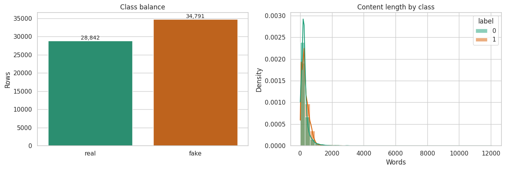
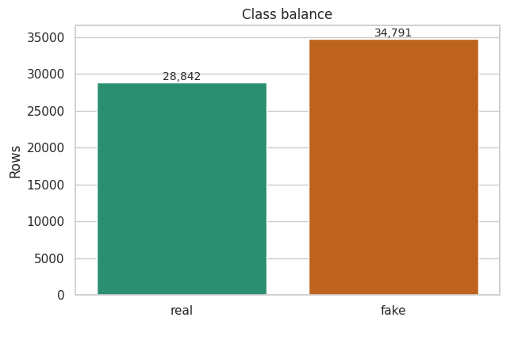
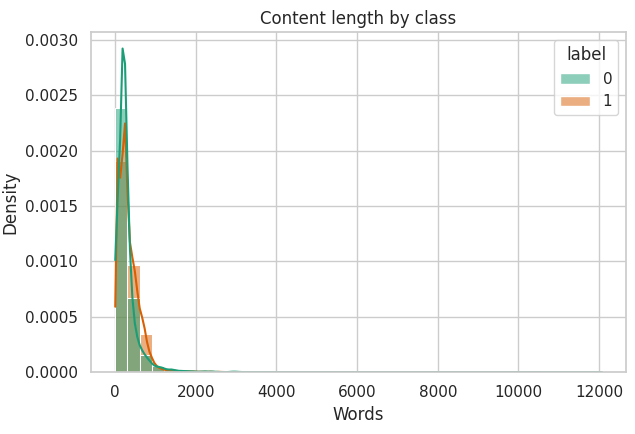
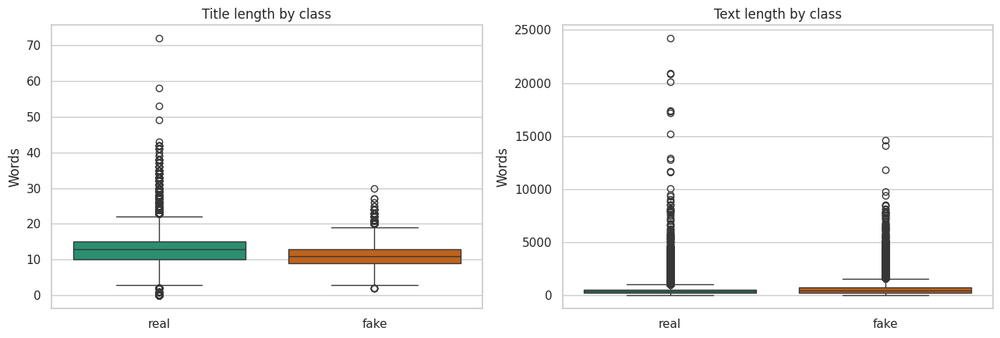
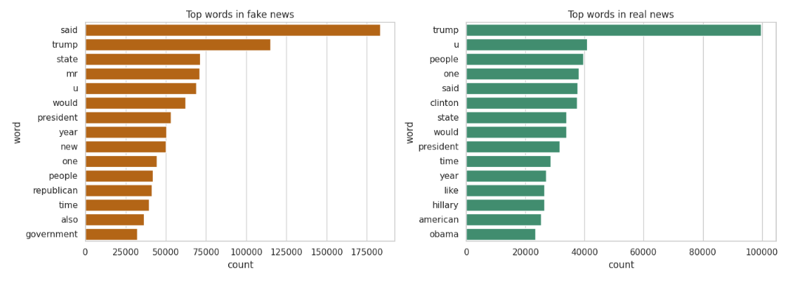
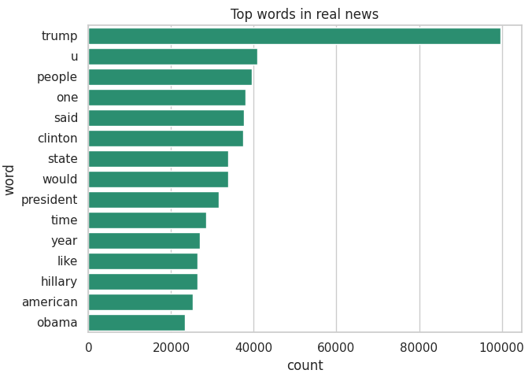

# PHÁT HIỆN TIN GIẢ BẰNG MACHINE LEARNING

## 1. Giới thiệu

Trong thời đại mạng xã hội phát triển, thông tin được lan truyền với tốc độ rất nhanh. Tuy nhiên, điều này cũng kéo theo một vấn đề nghiêm trọng: tin giả (fake news).

Tin giả có thể gây ảnh hưởng lớn đến xã hội, từ việc làm sai lệch nhận thức đến tác động đến chính trị và sức khỏe cộng đồng. Do đó, việc xây dựng hệ thống tự động phát hiện tin giả là một bài toán quan trọng trong lĩnh vực Data Science và NLP.

Theo các nghiên cứu gần đây, việc sử dụng các mô hình học máy có thể giúp phân loại tin giả với độ chính xác cao, thay thế phương pháp kiểm duyệt thủ công vốn không còn khả thi với khối lượng dữ liệu lớn.


## 2. Bài toán
Mục tiêu của bài toán là xây dựng một mô hình có thể phân loại một bài báo thành:
- Tin thật (Real news)
- Tin giả (Fake news)

|Input|Nội dung bài báo (text, title)|
|----|---|
|**Output**|**Nhãn phân loại (0 hoặc 1)**|

Đây là bài toán "*classification*" (phân loại nhị phân) trong Machine Learning.

## 3. Dataset
Trong project này, sử dụng dataset WELFake gồm:
- title
- text
- label

Dữ liệu lấy trong bộ csv: "WELFake_Dataset.csv" [2]

Nhận xét: Dữ liệu đã được gán nhãn sẵn, phù hợp cho bài toán supervised learning.

### Các vấn đề cần quan tâm:
- Dữ liệu có cân bằng không?
- Có missing values không?
- Có dữ liệu trùng lặp không?


### 3.1. Cleaning text
Dữ liệu văn bản thường chứa nhiều nhiễu, do đó cần làm sạch.

### Các bước xử lý:
- Chuyển về chữ thường  
- Loại bỏ URL  
- Loại bỏ HTML  
- Loại bỏ ký tự đặc biệt  
- Chuẩn hóa khoảng trắng  

### (Nâng cao):
- Stopwords removal  
- Lemmatization  

Nhận xét: Việc tiền xử lý giúp giảm nhiễu và cải thiện chất lượng feature.
```python
def clean(text: str) -> str:
    # Chuẩn hóa text cho baseline TF-IDF.
    text = str(text).lower()
    text = re.sub(r"[^a-z\\s]", " ", text)
    words = re.sub(r"\\s+", " ", text).strip().split()
    words = [word for word in words if word not in stop_words]
    words = [lemmatizer.lemmatize(word) for word in words]
    return " ".join(words)
```

### 3.2. Đánh giá mô hình trong một dictionary

Hàm *metric_row* gom các chỉ số đánh giá của một mô hình phân loại thành một dòng dữ liệu dạng *dictionary* để dễ so sánh giữa các mô hình khác nhau.

```python
# Hàm tính metric và vẽ confusion matrix.
def metric_row(family: str, model: str, split: str, y_true, y_pred, params=None) -> dict[str, object]:
    # Gom các metric thành 1 dòng để dễ so sánh giữa các model.
    return {
        "family": family,
        "model": model,
        "split": split,
        "accuracy": accuracy_score(y_true, y_pred),
        "precision": precision_score(y_true, y_pred, zero_division=0),
        "recall": recall_score(y_true, y_pred, zero_division=0),
        "f1": f1_score(y_true, y_pred, zero_division=0),
        "params": "" if params is None else json.dumps(params, sort_keys=True),
    }

```
Thay vì phải tính từng metric rồi lưu riêng lẻ, *metric_row* lưu vào một dòng dữ liệu thống nhất đưa vào bảng hoặc DataFrame để so sánh nhiều mô hình.


## 4. Phân tích dữ liệu (EDA)

Trước khi xây dựng mô hình, bước quan trọng là khám phá và hiểu rõ đặc điểm của tập dữ liệu.  
Vai trò của EDA:
- Quan sát phân phối độ dài nội dung theo từng lớp.
- Phát hiện các đặc điểm bất thường hoặc thiên lệch trong dữ liệu.

Qua đó, ta có cái nhìn trực quan về dữ liệu, từ đó định hướng các bước tiền xử lý và lựa chọn mô hình phù hợp.

### 4.1. Phân bố nhãn
- Đếm số lượng từng phần tử "real"/"fake" trong cột "label"
- Sử dụng **value_counts** 
```python
fig, axes = plt.subplots(1, 2, figsize=(13, 4.5))
count_df = df["label"].value_counts().sort_index().rename(index=names).reset_index()
count_df.columns = ["label_name", "count"]
```
Sau đó tạo biểu đồ bởi seaborn trả kết quả, mỗi cột thêm thông tin rõ ràng.

Nhận xét: Tình trạng số lượng mẫu dữ liệu gần như bằng nhau.



### 4.2 Độ dài văn bản
- Tin giả và tin thật có độ dài khác nhau không?

Tạo biểu đồ histogram hiển thị "Độ dài nội dung"




### 4.3. Phân cấp độ dài tiêu đề và chữ 
Tương tự, so sánh độ dài tiêu đề và chữ theo từng lớp.



### 4.4. Từ vựng phổ biến
- Các từ thường xuất hiện trong tin giả
Vẫn sử dụng hàm **Counter** đếm label 
```python
fake_words = Counter(" ".join(df.loc[df["label"] == 1, "content"]).split()).most_common(15)
real_words = Counter(" ".join(df.loc[df["label"] == 0, "content"]).split()).most_common(15)
```

Tần suất các từ xuất hiện trong **tin giả**.

Nội dung bài báo ghi lại từ lời nói các nhân vật chiếm phần lớn là thông tin sai.



Tần suất các từ xuất hiện trong **tin thật**.



Top word = "*trump*"

Nhận xét: Việc phân tích này giúp hiểu rõ đặc trưng của dữ liệu trước khi modeling.

## 5. Biểu diễn dữ liệu (Feature Engineering)
Máy học không hiểu text -> cần chuyển sang dạng số.

### 5.1. Giới thiệu TF-IDF

TF-IDF (Term Frequency – Inverse Document Frequency) là phương pháp biểu diễn văn bản phổ biến, cho phép đánh giá mức độ quan trọng của một từ trong một tài liệu so với toàn bộ tập dữ liệu.
Cụ thể, TF-IDF tăng trọng số cho những từ xuất hiện nhiều trong một văn bản nhưng hiếm trong các văn bản khác, từ đó giúp mô hình học máy tập trung vào các đặc trưng có giá trị phân biệt cao. Phương pháp này được sử dụng rộng rãi trong các hệ thống phân loại văn bản và phát hiện tin giả.


### 5.2. Tokenization (Deep Learning)
Trong các mô hình học sâu xử lý ngôn ngữ tự nhiên (NLP), văn bản cần được chuyển đổi thành dạng số để mô hình có thể hiểu và học được. 

Hai bước cơ bản bao gồm:
- Chuyển text -> sequence \
    Biến mỗi từ (token) trong văn bản thành một số nguyên mà vẫn giữ nguyên thứ tự.
    Thực hiện dùng `Tokenizer` trong Keras/TensorFlow.
- Padding để cùng độ dài \
    Các câu có độ dài khác nhau, cần chuẩn hóa về cùng một độ dài để đưa vào mô hình.
    Thực hiện dùng `pad_sequences`.


## 6. Mô hình
### 6.1. Baseline (TF-IDF + Linear Model)

- Nhanh
- Dễ triển khai
- Hiệu quả cao trong text classification


### 6.2. Deep Learning (LSTM / BERT)

- Hiểu ngữ cảnh tốt hơn
- Phù hợp với dữ liệu phức tạp

Các nghiên cứu cho thấy các mô hình học sâu và SVM có thể đạt độ chính xác cao hơn so với các phương pháp truyền thống.

## 7. Huấn luyện mô hình
### Quy trình:

1. Chia dữ liệu 
2. Huấn luyện model  
3. Điều chỉnh siêu tham số (Tuning hyperparameters)  
4. Sử dụng callbacks để tránh overfitting  

### 7.1. Chia tập train/validation/test
Logic chia dữ liệu theo tỉ lệ chuẩn để đảm bảo mô hình được đánh giá đúng.

```python
# Chia dữ liệu cho nhánh baseline và nhánh transformer.
X = df["content"]
X_raw = df["raw_content"]
y = df["label"]
```
X dùng cho TF-IDF \
X_raw dùng cho DistilBERT.

Chia train và test 
```python 
X_tv, X_test, y_tv, y_test = train_test_split(
    X,
    y,
    test_size=cfg.test_size,
    stratify=y,
    random_state=SEED,
)
X_raw_tv, X_raw_test = train_test_split(
    X_raw,
    test_size=cfg.test_size,
    stratify=y,
    random_state=SEED,
)
```

Tính tỉ lệ validation trong phần train và val 
```python
val_ratio = cfg.val_size / (1 - cfg.test_size)
```

Chia tiếp train và val 
```python
X_train, X_val, y_train, y_val = train_test_split(
    X_tv,
    y_tv,
    test_size=val_ratio,
    stratify=y_tv,
    random_state=SEED,
)
X_raw_train, X_raw_val = train_test_split(
    X_raw_tv,
    test_size=val_ratio,
    stratify=y_tv,
    random_state=SEED,
)
```


||split|rows|
|---|---|---|
|0|train|44542
|1|val|6364|
|2|test|12727|

Tỉ lệ cuối cùng:
- train ~ 70%
- val ~ 10%
- test ~ 20%

### 7.2. Train các baseline 
Sau khi huấn luyện sẽ so sánh trên tập validation.

```python
# Khối tiền xử lý đặc trưng của văn bản: biến dữ liệu text thành vector TF-IDF.
base_tfidf = TfidfVectorizer(
    stop_words="english",
    max_features=cfg.max_features,
    min_df=cfg.min_df,
    max_df=cfg.max_df,
    ngram_range=cfg.ngram_range,
)
```

Định nghĩa các baseline models và grid tham số.
Mỗi mô hình bao gồm:
- pipeline: nối bước TF-IDF với classifier.
- params: tập hyperpaprameters.
```python
model_specs = {
    # Mô hình 1: Naive Bayes (MultinomialNB) - phù hợp cho dạng dữ liệu text rời rạc, nhanh, thường là baseline mạnh mẽ.
    "naive_bayes": {
        "pipe": Pipeline([("tfidf", base_tfidf), ("clf", MultinomialNB())]),
        "params": {"clf__alpha": np.logspace(-3, 1, 30)},
    },

    # Mô hình 2: Logistic Regression - mô hình tuyến tính ân bằng class imbalance qua class_weight.
    "logistic_regression": {
        "pipe": Pipeline([("tfidf", base_tfidf), ("clf", LogisticRegression(max_iter=2000))]),
        "params": {
            "clf__C": np.logspace(-3, 2, 40),
            "clf__class_weight": [None, "balanced"],
        },
    },

    # Mô hình 3: Linear SVC - tối ưu margin 
    "linear_svc": {
        "pipe": Pipeline([("tfidf", base_tfidf), ("clf", LinearSVC())]),
        "params": {
            "clf__C": np.logspace(-3, 2, 40),
            "clf__class_weight": [None, "balanced"],
        },
    },
}
```

### 7.3. Tuning hyperparameters
`RandomizedSearchCV` chọn ngẫu nhiên một số lượng tổ hợp để thử nghiệm.

Ưu điểm:
- Nhanh hơn GridSearchCV: Khi không gian siêu tham số lớn, *RandomizedSearchCV* tiết kiệm thời gian và tài nguyên.
- Có thể chỉ định số lần thử `n_iter` để kiểm soát độ rộng tìm kiếm.
```python
#RandomizedSearchCV
search = RandomizedSearchCV(
        estimator=spec["pipe"],
        param_distributions=spec["params"],
        n_iter=12,
        scoring="f1",
        cv=cfg.cv,
        n_jobs=-1,
        random_state=SEED,
        refit=True,
    )
    search.fit(X_train, y_train)
```

## 8. Đánh giá mô hình
Đánh giá DistilBERT trên *validation* và *test*.

Không chỉ dùng accuracy, cần sử dụng:

- Precision  
- Recall  
- F1-score  
- Confusion Matrix  


```python
# trf_val là kết quả validation
trf_val = pd.DataFrame(
    [
        {
            "family": "transformer",
            "model": cfg.model_ckpt,
            "split": "val",
            "accuracy": float(val_out["eval_accuracy"]),
            "precision": float(val_out["eval_precision"]),
            "recall": float(val_out["eval_recall"]),
            "f1": float(val_out["eval_f1"]),
            "params": "",
        }
    ]
)

# trf_test là kết quả test
trf_test = pd.DataFrame([metric_row("transformer", cfg.model_ckpt, "test", y_test, trf_pred)])
```
Nhận xét: F1-score đặc biệt quan trọng trong bài toán này vì cần cân bằng giữa false positive và false negative.

Mô hình được đánh giá trên tập validation và test, kết quả như sau:

## 9. Kết quả và phân tích
- Model đạt độ chính xác: ...  
- So sánh giữa các model  

### Nhận xét:
- Model nào tốt hơn?
- Vì sao?

## 10. Phân tích lỗi (Error Analysis)
- Các trường hợp model dự đoán sai  
- Nguyên nhân:
  - ngôn ngữ mơ hồ
  - thiếu context
  - tiêu đề gây hiểu nhầm  

Nhận xét: Đây là phần thể hiện tư duy Data Science rõ nhất.


## 11. Hạn chế

- Dataset chưa đủ đa dạng  
- Chỉ dựa vào text  
- Không sử dụng context từ social media  


## 12. Hướng phát triển

- Sử dụng BERT / Transformer  
- Kết hợp dữ liệu mạng xã hội  
- Xây dựng hệ thống realtime  


## 13. Kết luận

Bài toán phát hiện tin giả có thể được giải quyết hiệu quả bằng các phương pháp Machine Learning và NLP.

Project này không chỉ dừng ở việc xây dựng mô hình, mà còn thể hiện một pipeline hoàn chỉnh từ xử lý dữ liệu, xây dựng model đến đánh giá và phân tích.

Trong tương lai, việc kết hợp các mô hình nâng cao và dữ liệu đa nguồn sẽ giúp cải thiện độ chính xác và tính ứng dụng thực tế.

## 14. Nguồn tham khảo
[1] [Thumbnail - Canva Education](https://www.canva.com/)

[2] [Website Kaggle - Fake news](https://www.kaggle.com/datasets/saurabhshahane/fake-news-classification/)
